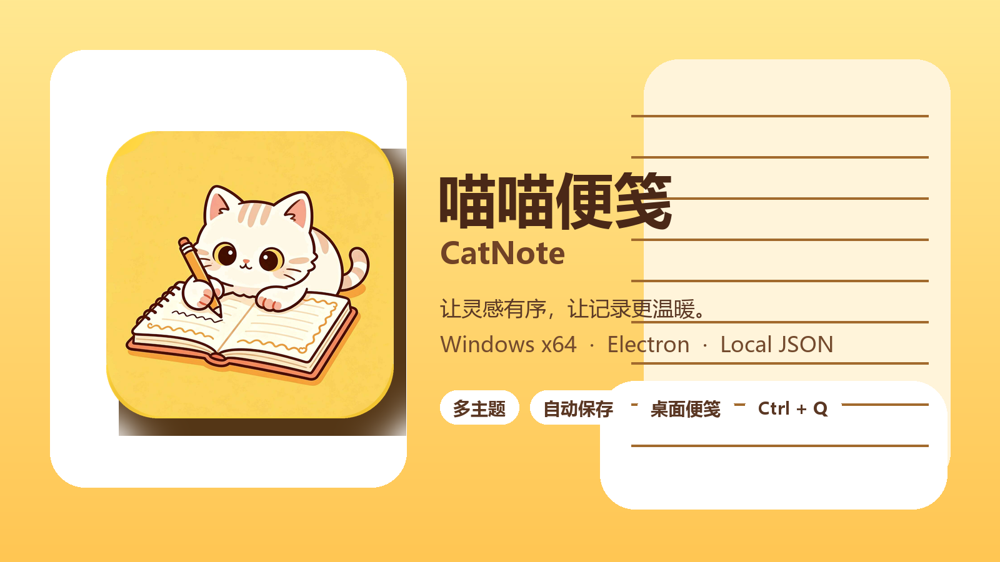

# 喵喵便签 CatNote

[](./package.json)
[](./package.json)
[](./LICENSE)



---

## 简介

喵喵便签（CatNote）是一款面向 Windows x64 平台的轻量级桌面便签工具，基于 Electron、HTML、CSS 和 JavaScript 构建，使用本地 JSON 保存数据。

它提供多主题、全局搜索、自由拖动、桌面便签、窗口置顶、快速创建和自动保存等功能，适合记录碎片化信息与日常摘录。

当前项目已整合源码、应用图标、封面图、Windows x64 便携打包脚本和 GitHub 仓库说明，可从源码运行，也可以打包成桌面应用。

## 功能特性

- 智能搜索：通过顶部搜索栏，按标题、内容或修改日志快速筛选便签。
- 自由拖动：卡片的非输入、非按钮区域均可拖动，布局更灵活。
- 背景移动：长按右键可拖动背景，卡片会吸附在背景上一起移动。
- 一键整理：在 Edit 菜单中点击“整理”，所有便签按最后修改时间排序，每行最多 6 张。
- 多级主题：支持淡红、淡蓝、淡绿、淡粉、淡灰、黑白和原色等主题。
- 单卡主题：每张便签可独立设置配色，不影响全局主题。
- 添加到桌面：可将当前便签复制为独立桌面卡片。
- 桌面便签编辑：拖出的桌面便签支持修改、保存和摘录。
- 窗口置顶：桌面便签可设置为始终显示在其他窗口上方。
- 全局快捷键：程序后台运行时，按 `Ctrl + Q` 可快速新建桌面便签，并同步出现在主应用中。
- 自动保存：输入完成后自动保存，不需要手动点击保存。
- 本地存储：数据保存在 `notes.json`，便于备份与迁移。

## 系统要求

- 操作系统：Windows 10 / Windows 11（64 位）
- 分辨率：建议 1366 × 768 或更高
- 源码运行：需要 Node.js 18+ 和 npm
- 便携版运行：无需额外安装 Node.js，解压后运行 `CatNote.exe`

## 安装与运行

### 使用桌面应用便携版

1. 从 `dist/` 或 Releases 下载 `CatNote-win-x64-portable.zip`。
2. 解压到任意目录。
3. 进入 `CatNote` 文件夹，双击 `CatNote.exe`。
4. 也可以双击 `启动喵喵便签.bat` 启动。

### 使用安装包

1. 从 `dist/` 或 Releases 下载 `CatNote-win-x64-installer.zip`。
2. 解压后双击 `install.bat`。
3. 安装脚本会将应用复制到 `%LOCALAPPDATA%\CatNote`，并在桌面创建快捷方式。

### 从源码启动

```bash
npm install
npm start
```

Windows 下也可以双击 `start.bat` 或 `启动项目版.bat`。

## 使用指南

| 操作 | 方法 |
| --- | --- |
| 新建便签 | 主界面点击 `+`，或后台按 `Ctrl + Q` |
| 搜索便签 | 在顶部搜索框输入关键词 |
| 拖动便签 | 按住卡片的非输入、非按钮区域拖动 |
| 拖动背景 | 在搜索栏外长按右键并移动鼠标 |
| 修改全局主题 | 点击搜索框左侧主题按钮 |
| 修改卡片主题 | 点击卡片圆形菜单中的“修改主题” |
| 添加到桌面 | 在卡片菜单中选择“添加到桌面” |
| 编辑桌面便签 | 点击桌面便签上的“修改” |
| 置顶桌面便签 | 点击桌面便签上的“置顶/取消置顶” |
| 一键整理 | 菜单栏 `Edit` -> `整理` |
| 删除便签 | 卡片菜单 -> `删除` -> 确定 |

## 开发与构建

- 开发框架：Electron
- 前端实现：HTML / CSS / JavaScript
- 主进程文件：`mian.js`
- 数据存储：本地 JSON
- 应用图标：`assets/icon-source.jpg` 生成 `assets/app-icon.png` 和 `assets/app-icon.ico`
- 封面图：`assets/cover.png`
- 构建脚本：`scripts/build-icon.js`、`scripts/build-cover.js`、`scripts/apply-exe-icon.py`、`scripts/package-win.js`

常用命令：

```bash
npm run build:icon
npm run build:cover
npm run package:win
npm run build:win
```

构建后主要产物：

```text
dist/win-x64/CatNote/CatNote.exe
dist/CatNote-win-x64-portable.zip
dist/CatNote-win-x64-installer.zip
dist/installer/install.bat
```

说明：默认生成稳定的便携版 zip 和安装包 zip。若需要尝试生成 IExpress EXE 安装器，可在 Windows 中设置 `CREATE_IEXPRESS=1` 后重新运行 `npm run package:win`。

## 项目结构

```text
CatNote/
├─ assets/             # 图标源图、应用图标和封面图
├─ scripts/            # 图标、封面和 Windows 打包脚本
├─ index.html          # 主界面
├─ mian.js             # Electron 主进程
├─ notes.json          # 本地便签数据
├─ package.json        # 项目配置与 npm 脚本
├─ package-lock.json   # 依赖锁定
├─ README.md           # 项目说明
├─ LICENSE             # MIT 许可证
└─ start.bat           # Windows 源码启动脚本
```

## 许可证

本项目基于 MIT 许可证开源，详情请参阅 [LICENSE](./LICENSE)。

## 更新日志

### v1.0（2026-07-21）

- 整合 Electron 桌面应用源码
- 完成搜索、拖动、整理、主题切换、桌面便签、置顶、删除、自动保存和全局快捷键
- 生成猫猫记笔记应用图标与项目封面图
- 完成 Windows x64 便携版打包脚本

喵喵便签 CatNote，让灵感有序，让记录更温暖。
